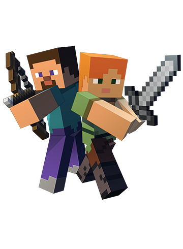

 

### Preserving Minecraft's history

---

## 🏗️ What is Minecraft Legacy?

**Minecraft Legacy** is a community-driven initiative dedicated to **archiving, preserving, and indexing** legacy Minecraft source code, tools, launchers, and resources that might otherwise be lost to time.

The source code for Minecraft Legacy Console Edition (October 2014 build) was recently leaked on 4chan. The community has been working to **preserve, fix, and build upon** that codebase - ensuring it isn't lost to history. Minecraft Legacy exists to support and index these preservation efforts alongside other legacy projects.

We maintain a curated index of repositories spanning old editions, fan-made tools, archived source dumps, and community projects - all searchable and sorted by priority on our website.

## 📦 Key Repositories

| Repo | Description |
|------|-------------|
| [**MinecraftLegacy**](https://github.com/MinecraftConsole/MinecraftLegacy) | Source code for [minecraftlegacy.com](https://minecraftlegacy.com) |
| [**json**](https://github.com/MinecraftConsole/json) | Project registry - the JSON data that powers the site's repo list |

## 🔍 How It Works

All listed projects live in a single [`projects.json`](https://github.com/MinecraftConsole/json/blob/main/projects.json) file. The website fetches this at runtime and renders a searchable, paginated index with priority rankings.

**Want to add a project?** Open an issue or PR on the [json repo](https://github.com/MinecraftConsole/json) using our templates.

## 🤝 Contributing

We welcome contributions! Whether it's submitting a legacy project to the index, reporting a bug on the site, or improving documentation - every bit helps preserve Minecraft history.

1. **Submit a project** → [Open an issue](https://github.com/MinecraftConsole/json/issues/new?template=project-request.yml) on the json repo
2. **Report a bug** → [Open an issue](https://github.com/MinecraftConsole/json/issues/new?template=bug-report.yml)
3. **Contribute code** → Fork the [MinecraftLegacy](https://github.com/MinecraftConsole/MinecraftLegacy) repo and open a PR

---

Not affiliated with Mojang AB or Microsoft. "Minecraft" is a trademark of Mojang Synergies AB.

